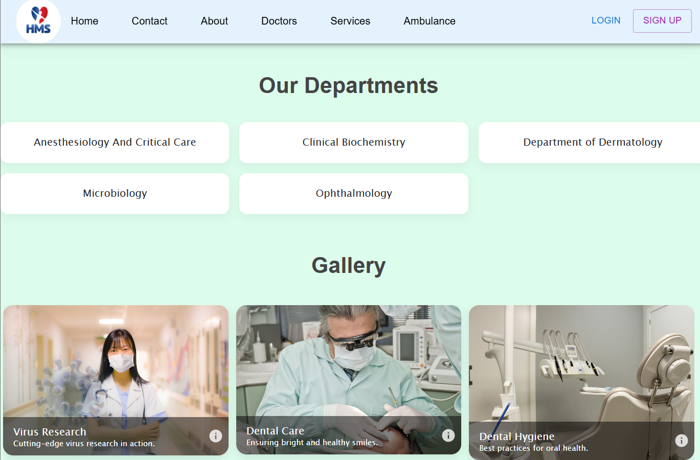
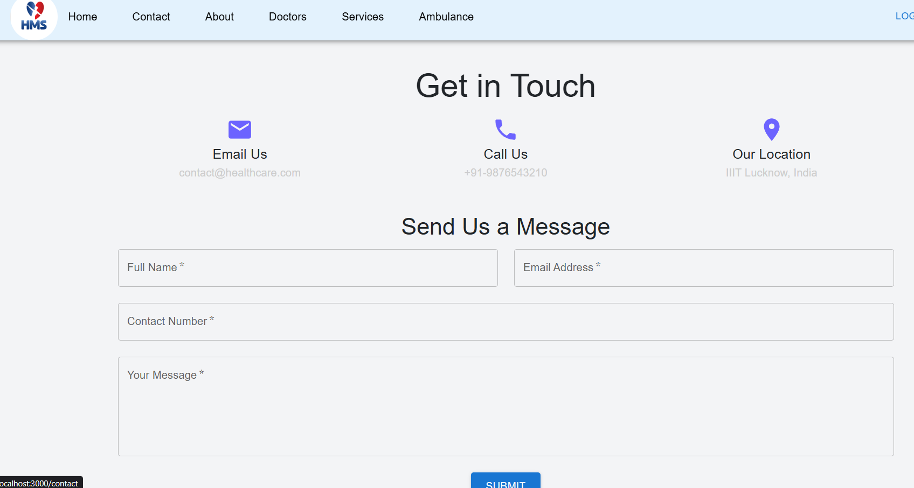
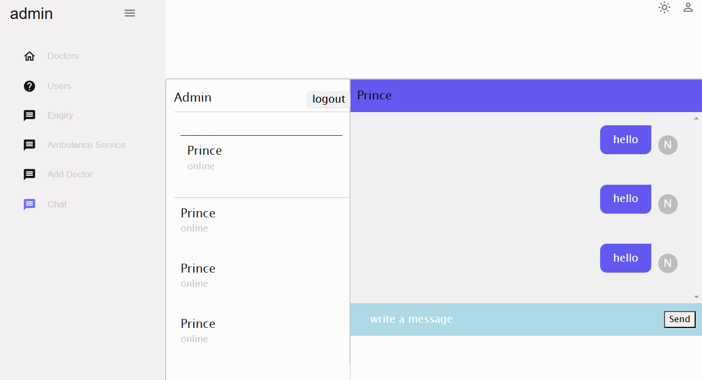

# Hospital Management System


Hospital Management System using MongoDb, Express and React

## Language and Technology used:

1. Html,css
2. Javascript
3. React
4. MongoDb
5. Express

## Installing

# Installing - easy ::
1.	Download the repository
```
git clone  https://github.com/prince9569/Project2.git
```
2.	Open the Terminal (Linux & MacOS) or PowerShell (Windows) and change directory to the project folder.
3. Go to frontend folder and type " npm install " in the terminal and press Enter.All the dependencies of frontend would be installed.
```bash 
cd frontend 
npm install 
```
4. Go to backed  folder and type " npm install " in the terminal and press Enter.All the dependencies of backed  would be installed.
```bash 
cd backend  
npm install 
```

5.	Go back to the Terminal (PowerShell) and be sure that you are pointing inside the project folder. To open the application, type ‘npm run dev ’ and press Enter.
6.	The application should be live on the local port 3000.  
7.	Type http://localhost:3000/ into a browser.

8.	Now you should be inside the application
** Do not forget to change details in .env file in backend (database is local only till now.)


## Gettint Into The project


## Screenshots

## HomePage
Hospital Management System in mern stack. This system has a ‘Home’ page from where the patient & administrator can login into their accounts by toggling the tabs accordingly...

  


## Contact us page

‘Contact’ page allows users to provide feedback or queries about the services of the hospital. 
 


## Login
To make  a Appointment of Doctor user must be login first.

##  Book his/her appointment:
After Login in successfully user book their  Appointment. The appointment form requires patients to select  Date and Time that they want to meet with the doctor and add their desease. The consultancy fee will be added by the administrator.

## Add invoice from admin pannel

After the process of Appointment is completed.Administrator add the invoice for each Appointment.

## Admin module

   This module is the heart of our project where an admin can see the list of all patients. Admin also can add the invoice for each user..who make a appointment of doctor. Admin can also Add docotor ,Delete Doctor.

   



